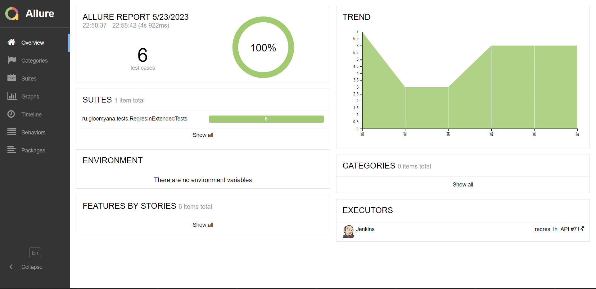
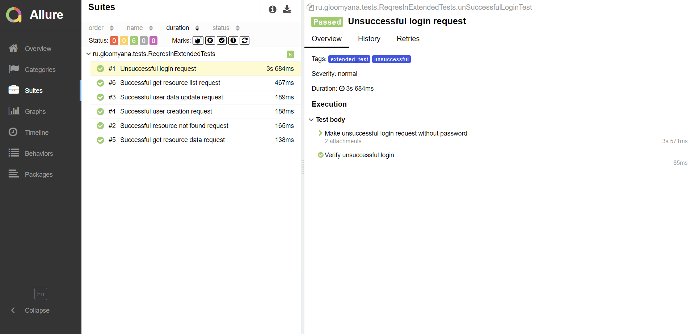
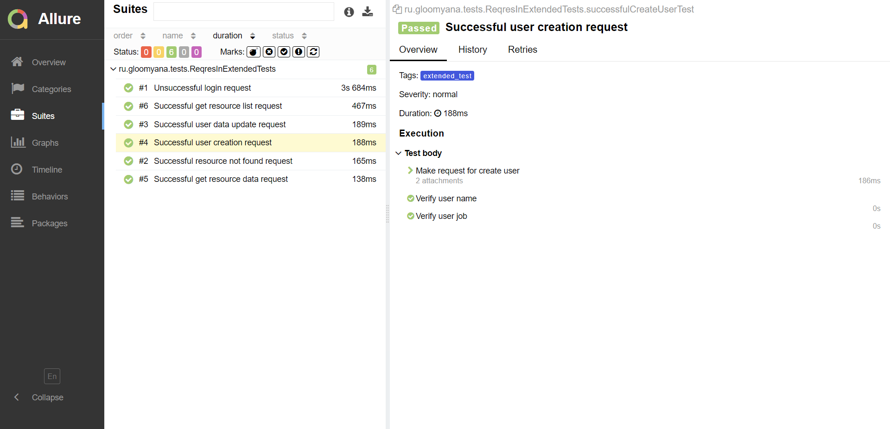

# Демопроект автоматизации тестирования API на [reqres.in](https://reqres.in/)

## :page_facing_up: Cодержание
- [Технологии и иструменты](#hammer_and_wrench-технологии-и-иструменты)
- [Реализованные проверки](#white_check_mark-реализованные-проверки)
- [Сборка в Jenkins](#-сборка-в-jenkins)
- [Allure отчет](#-allure-отчет)

## :hammer_and_wrench: Технологии и иструменты

## :white_check_mark: Реализованные проверки
- Успешное создание пользователя
- Успешное изменение данных пользователя
- Неуспешная авторизация
- Успешный запрос на получение списка (с использованием JSON-схемы)
- Успешный запрос на получение данных
- Запрос несуществующих данных

##  Сборка в Jenkins
[Сборка в Jenkins](https://jenkins.autotests.cloud/job/reqres_in_API/) 

##  Allure отчет
[Allure отчет](https://jenkins.autotests.cloud/job/reqres_in_API/7/allure/) 

Главная страница отчета Allure содержит следующие блоки:
- **ALLURE REPORT** - отображает дату и время теста, общее количество запущенных тестов, а также диаграмму с процентом и количеством успешных, упавших и сломавшихся в процессе выполнения тестов
- **TREND** - отображает тенденцию выполнения тестов для всех запусков
- **SUITES** - отображает распределение тестов по сьютам

 

Список тестов с шагами:

